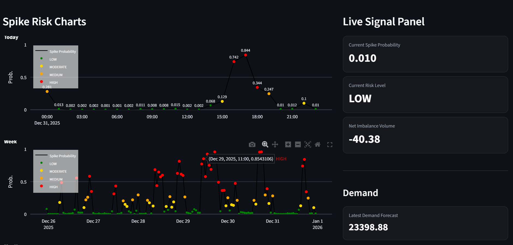

# UK Power Market Spike Early Warning System

A pseudo-real-time power market monitoring and spike early warning system built with UK electricity demand, generation, weather, and balancing market data.

## Project Overview

This project develops an end-to-end analytics workflow for monitoring and forecasting power market spike risk in the UK electricity market.

The system combines:
- multi-source data ingestion
- demand forecasting
- feature engineering with real-time logic adjustments
- spike risk modelling
- a Streamlit dashboard for pseudo-real-time monitoring

The core objective is not only to detect price spike events, but to provide a decision-support style monitoring tool that helps identify high-risk intervals and explain the drivers behind elevated market stress.

---

## Project Motivation

Electricity market prices can spike when the system becomes stressed due to imbalance, changing generation mix, or supply-demand pressure.

This project was designed to answer four practical questions:

1. What is the current level of spike risk?
2. Is spike risk increasing or decreasing recently?
3. Which system drivers are contributing to this risk?
4. Which time intervals should be prioritised for monitoring?

---

## Data Sources

The project uses multiple public data sources:

### 1. Electricity Demand Data
Source: NESO demand data  
Used for:
- actual demand series
- hourly demand aggregation
- demand forecasting pipeline

### 2. Weather Data
Source: Open-Meteo archive API  
Variables used:
- temperature
- relative humidity
- wind speed

Used for:
- demand forecasting
- market condition interpretation

### 3. Supply / Generation Data
Source: Elexon FUELHH dataset  
Used for:
- generation by fuel type
- supply-side driver construction

Examples:
- CCGT
- WIND
- PS
- OCGT
- OTHER
- INTIRL
- NPSHYD

### 4. Balancing / Price Data
Source: Elexon balancing system prices dataset  
Variables used:
- SystemSellPrice
- SystemBuyPrice
- NetImbalanceVolume
- TotalAcceptedOfferVolume
- TotalAcceptedBidVolume

---

## Project Workflow

### Step 1. Demand and Weather Data Ingestion
Notebook:
- `01_demand_and_weather_data_ingestion.ipynb`

Main tasks:
- download historical demand data
- convert half-hourly data to hourly data
- retrieve weather data from Open-Meteo
- save raw demand and weather datasets

### Step 2. Demand-Weather Merge and EDA
Notebook:
- `02_demand_weather_merge_and_EDA.ipynb`

Main tasks:
- merge hourly weather and demand data
- inspect missing values and correlations
- visualise demand behaviour over time
- prepare demand modelling base table

### Step 3. Demand Forecasting and Feature Engineering
Notebook / script:
- `03_demand_error_model_feature_engineering_and_forecasting.py`

Main tasks:
- build calendar features
- create lag features
- create rolling mean / rolling standard deviation features
- train demand forecasting models
- generate demand prediction output

Examples of demand features:
- `demand_lag_1`
- `demand_lag_24`
- `demand_lag_168`
- `demand_roll_24`
- `demand_roll_24std`
- `temp_roll_24`

### Step 4. Supply Data Ingestion and Transformation
Notebook:
- `04_supply_data_ingestion_and_feature_enginerring.ipynb`

Main tasks:
- download FUELHH supply data
- clean timestamps
- pivot fuel type generation into columns
- aggregate half-hourly data to hourly level

### Step 5. Price Data Ingestion and Final Dataset Merge
Notebook:
- `05_price_data_ingestion_and_final_dataset_merge.ipynb`

Main tasks:
- download balancing market price data
- aggregate half-hourly price data to hourly level
- merge demand, supply, and price related variables
- prepare final modelling dataset

### Step 6. Spike Definition and Spike Feature Engineering
Notebook:
- `06_price_splike_building_EDA_feature_engineering.ipynb`

Main tasks:
- define spike events using a rolling quantile rule
- create spike classification target
- engineer system stress variables

Final spike definition:
- rolling 75th percentile threshold
- historical lookback with shift logic to reduce leakage

Examples of engineered features:
- `ccgt_wind_ratio`
- `imbalance_ccgt`
- `ps_imbalance`
- `offer_bid_spread`

### Step 7. Spike Model Building and Prediction
Notebook:
- `07_price_splike_model_building_and_predicting.ipynb`

Main tasks:
- split data using time-based train/test logic
- train spike classification models
- evaluate model performance
- compare model outputs

Models explored:
- Random Forest Classifier
- LightGBM Classifier

### Step 8. Final Real-Time Logic Adjustment
Notebook:
- `08_final_model_adjustment.ipynb`

Main tasks:
- identify variables that are not truly observable in real time
- apply lag logic to non-real-time variables
- rebuild engineered features using lagged inputs
- generate final dashboard-ready dataset

This step is important because the project aims to simulate a realistic operational setting rather than using information that would only be known after the event.

---

## Real-Time Design Logic

A key design principle of this project is the distinction between:

- information available at decision time
- realised outcomes only observable after the fact

In a real trading or operations setting, future spike events are not directly observable at the time of action. Therefore:

- `y_prob` is treated as the real-time spike risk estimate
- `risk_level` is treated as the real-time monitoring signal
- `is_spike` is treated as a post-event validation label

To make the workflow more realistic:
- supply-side variables were lagged where necessary
- engineered features were rebuilt using lagged inputs
- leakage-prone variables were adjusted before final dashboard construction

---

## Main Variables

### Core Drivers
- `NetImbalanceVolume`
- `CCGT_lag_1`
- `WIND_lag_1`
- `PS_lag_1`
- `TotalAcceptedBidVolume_lag_1`

### Engineered Features
- `ccgt_wind_ratio`
- `imbalance_ccgt`
- `ps_imbalance`
- `offer_bid_spread`

### Prediction Outputs
- `y_prob`
- `y_pred`
- `risk_level`
- `is_spike`

---

## Dashboard

## Dashboard



The current dashboard is a prototype for demonstration purposes only.  
A production-ready, fully operational dashboard is still under development.

---

## Project Structure

```text
powering_market_forecasting_analytics/
├── dashboard/
│   └── app.py
├── data/
│   ├── raw/
│   ├── interim/
│   └── processed/
├── figures/
├── notebooks/
│   ├── 01_demand_and_weather_data_ingestion.ipynb
│   ├── 02_demand_weather_merge_and_EDA.ipynb
│   ├── 03_demand_error_model_feature_engineering_and_forecasting.py
│   ├── 04_supply_data_ingestion_and_feature_enginerring.ipynb
│   ├── 05_price_data_ingestion_and_final_dataset_merge.ipynb
│   ├── 06_price_splike_building_EDA_feature_engineering.ipynb
│   ├── 07_price_splike_model_building_and_predicting.ipynb
│   └── 08_final_model_adjustment.ipynb
├── reports/
└── src/
    ├── extract/
    ├── features/
    └── ...